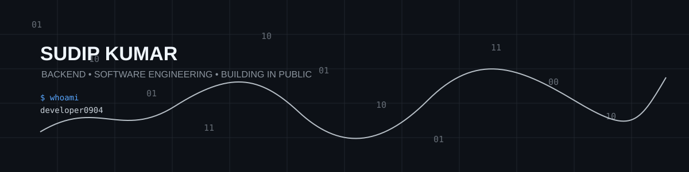

<div align="center">



# Hi 👋, I'm Sudip Kumar

### Backend Developer · Java · DSA · DevOps

**I build backend systems, solve problems, and turn what I learn into working software.**

<a href="https://github.com/developer0904">GitHub</a> · <a href="https://www.linkedin.com/in/sudipkumardas2026/">LinkedIn</a> · <a href="https://developer0904.github.io/">Portfolio</a>

</div>

---

## 🧑‍💻 About Me

<table>
<tr>
<td width="62%" valign="top">

### Building with purpose, learning by shipping.

I'm a **Computer Engineering student and aspiring Backend Engineer** focused on building a strong foundation in software engineering rather than simply collecting technologies.

I enjoy taking a concept from **DSA, object-oriented programming, databases or backend development** and turning it into something that actually works.

Currently, my main focus is **Java and backend engineering** — strengthening my problem-solving skills, learning how production APIs are designed, and understanding the engineering decisions behind scalable applications.

I'm also exploring **DevOps, cloud infrastructure and automation**, because I want to understand the complete journey of software: from writing code → testing it → deploying it → keeping it reliable.

### 🎯 What I'm working toward

- 🧠 Becoming significantly stronger at **DSA & problem solving**
- ☕ Building depth in **Java & backend development**
- 🔌 Designing clean and reliable **REST APIs**
- 🗄️ Getting better with **SQL, databases & data modeling**
- 🐳 Learning **Docker, CI/CD, cloud & DevOps practices**
- 🚀 Building projects that demonstrate real engineering ability

</td>
<td width="38%" align="center" valign="middle">


<br/>


</td>
</tr>
</table>

---

## ⚒️ Tech Stack

### Core


### Backend


### Data & Infrastructure


---

## 🚀 Featured Projects

<table>
<tr>
<td width="50%" valign="top">

### 📌 Pin Panda — Backend

Backend application built with the Node.js ecosystem, working with authentication, middleware and MongoDB-oriented development.

**Stack:** `Node.js` `Express` `MongoDB` `Passport.js`

<a href="https://github.com/developer0904/Pin_Panda_BackEnd">View project →</a>

</td>
<td width="50%" valign="top">

### 🐄 Livestock Management API

Django REST backend with JWT authentication and APIs for animals, owners, events, inventory and reports, including filtering, search, ordering and pagination.

**Stack:** `Python` `Django REST Framework` `JWT` `SQL`

<a href="https://github.com/developer0904/livestock-backend">View project →</a>

</td>
</tr>
<tr>
<td width="50%" valign="top">

### ⚙️ Infrastructure Automation

A dedicated space for experimenting with infrastructure, automation and DevOps workflows.

**Focus:** `DevOps` `Automation` `Infrastructure`

<a href="https://github.com/developer0904/infra-automation">View project →</a>

</td>
<td width="50%" valign="top">

### 🧩 DSA Practice

An evolving collection of LeetCode and algorithmic problem-solving practice, focused on patterns and implementation.

**Focus:** `Java` `Data Structures` `Algorithms`

<a href="https://github.com/developer0904/leetCode_DSA">View repository →</a>

</td>
</tr>
</table>

---

## 🧠 Current Learning Path

```text
Java & OOP
    ↓
Collections · Generics · Lambdas · Exceptions
    ↓
DSA & Problem Solving
    ↓
Spring Boot · REST APIs · Databases
    ↓
Docker · CI/CD · Cloud · DevOps
    ↓
Production-ready Backend Engineering
```

---

## 📊 GitHub Activity

<div align="center">


<br/><br/>

[](https://github.com/developer0904)

</div>

---

## 🤝 Connect With Me

<div align="center">

<a href="https://github.com/developer0904"></a>
<a href="https://www.linkedin.com/in/sudipkumardas2026/"></a>
<a href="https://developer0904.github.io/"></a>

</div>

---

<div align="center">

### `Build → Learn → Improve → Ship`


</div>
